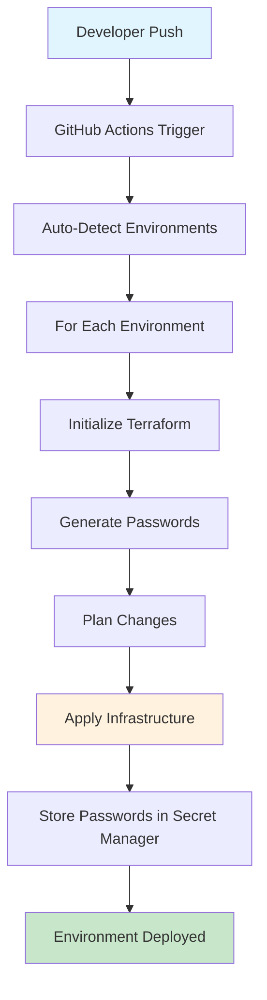

# Terraform Infrastructure Automation

## Overview
Automated Terraform deployment system for GCP CloudSQL environments using GitHub Actions CI/CD.

##  Key Features
-  **Fully Automated**: Push to deploy - no manual triggers
-  **Multi-Environment**: Auto-detects and deploys all environments
-  **Remote State**: All state stored in GCS bucket
-  **Secure**: Workload Identity Federation, no hardcoded credentials
-  **Production-Ready**: State locking, error handling, password management

##  Project Structure
```
das-l4-infra-np/
├── .github/workflows/
│   └── terraform.yml          # Main deployment workflow
├── environments/
│   ├── non-prod/
│   │   └── dev/               # Development environment
│   │       ├── main.tf        # CloudSQL configuration
│   │       ├── variables.tf   # Variable definitions
│   │       ├── backend.tf     # Remote state config
│   │       └── terraform.tfvars
│   └── production/
│       └── prod/              # Production environment
├── WORKFLOW_SUMMARY.md        # Workflow documentation
├── SHOWCASE_GUIDE.md          # Demo guide
├── TESTING_GUIDE.md           # Testing procedures
└── SETUP_GUIDE.md             # Setup instructions
```

##  Workflow Overview



##  Quick Start

### 1. Add New Environment
```bash
# Copy existing environment
cp -r environments/non-prod/dev environments/non-prod/new-env

# Update configuration files
# Edit main.tf, variables.tf, backend.tf, terraform.tfvars

# Push to deploy
git add .
git commit -m "Add new environment"
git push
```

### 2. Update Environment
```bash
# Make changes to environment files
# Push to deploy
git add .
git commit -m "Update environment"
git push
```

##  Security Features
- **Workload Identity Federation**: No hardcoded credentials
- **Remote State**: All state in GCS bucket
- **Password Management**: Stored in GCP Secret Manager
- **State Locking**: Prevents concurrent modifications

##  Current Environments
-  **dev**: Development environment (PostgreSQL 16)

##  Technical Stack
- **Terraform**: 1.8.2
- **State Storage**: GCS bucket `terraform-statefile-p`
- **Authentication**: Workload Identity Federation
- **CI/CD**: GitHub Actions
- **Database**: PostgreSQL 16 on CloudSQL

##  Documentation
- [Workflow Summary](WORKFLOW_SUMMARY.md) - Detailed workflow documentation
- [Showcase Guide](SHOWCASE_GUIDE.md) - Demo and presentation guide
- [Testing Guide](TESTING_GUIDE.md) - Testing procedures
- [Setup Guide](SETUP_GUIDE.md) - Initial setup instructions

##  Benefits
- **Simple**: Just Git operations
- **Automated**: No manual intervention
- **Reliable**: Consistent deployment process
- **Scalable**: Easy to add new environments
- **Secure**: Production-grade security
