# 🚀 Terraform Infrastructure Automation

## Overview
Automated Terraform deployment system for GCP CloudSQL environments using GitHub Actions CI/CD.

## 🎯 Key Features
- ✅ **Fully Automated**: Push to deploy - no manual triggers
- ✅ **Multi-Environment**: Auto-detects and deploys all environments
- ✅ **Remote State**: All state stored in GCS bucket
- ✅ **Secure**: Workload Identity Federation, no hardcoded credentials
- ✅ **Production-Ready**: State locking, error handling, password management

## 📁 Project Structure
```
das-l4-infra-np/
├── .github/workflows/
│   └── terraform.yml          # Main deployment workflow
├── environments/
│   ├── non-prod/
│   │   └── dev/               # Development environment
│   │       ├── main.tf        # CloudSQL configuration
│   │       ├── variables.tf   # Variable definitions
│   │       ├── backend.tf     # Remote state config
│   │       └── terraform.tfvars
│   └── production/
│       └── prod/              # Production environment
├── WORKFLOW_SUMMARY.md        # Workflow documentation
├── SHOWCASE_GUIDE.md          # Demo guide
├── TESTING_GUIDE.md           # Testing procedures
└── SETUP_GUIDE.md             # Setup instructions
```

## 🔄 Workflow Overview

```mermaid
graph TD
    A[Developer Push] --> B[GitHub Actions Trigger]
    B --> C[Auto-Detect Environments]
    C --> D[For Each Environment]
    D --> E[Initialize Terraform]
    E --> F[Generate Passwords]
    F --> G[Plan Changes]
    G --> H[Apply Infrastructure]
    H --> I[Store Passwords in Secret Manager]
    I --> J[✅ Environment Deployed]
    
    style A fill:#e1f5fe
    style J fill:#c8e6c9
    style H fill:#fff3e0
```



## 🚀 Quick Start

### 1. Add New Environment
```bash
# Copy existing environment
cp -r environments/non-prod/dev environments/non-prod/new-env

# Update configuration files
# Edit main.tf, variables.tf, backend.tf, terraform.tfvars

# Push to deploy
git add .
git commit -m "Add new environment"
git push
```

### 2. Update Environment
```bash
# Make changes to environment files
# Push to deploy
git add .
git commit -m "Update environment"
git push
```

## 🛡️ Security Features
- **Workload Identity Federation**: No hardcoded credentials
- **Remote State**: All state in GCS bucket
- **Password Management**: Stored in GCP Secret Manager
- **State Locking**: Prevents concurrent modifications

## 📊 Current Environments
- ✅ **dev**: Development environment (PostgreSQL 16)

## 🔧 Technical Stack
- **Terraform**: 1.8.2
- **State Storage**: GCS bucket `terraform-statefile-p`
- **Authentication**: Workload Identity Federation
- **CI/CD**: GitHub Actions
- **Database**: PostgreSQL 16 on CloudSQL

## 📚 Documentation
- [Workflow Summary](WORKFLOW_SUMMARY.md) - Detailed workflow documentation
- [Showcase Guide](SHOWCASE_GUIDE.md) - Demo and presentation guide
- [Testing Guide](TESTING_GUIDE.md) - Testing procedures
- [Setup Guide](SETUP_GUIDE.md) - Initial setup instructions

## 🎯 Benefits
- **Simple**: Just Git operations
- **Automated**: No manual intervention
- **Reliable**: Consistent deployment process
- **Scalable**: Easy to add new environments
- **Secure**: Production-grade security
