# 🛠️ Terraform Infrastructure Setup Guide

## Overview
Complete setup guide for the automated Terraform infrastructure deployment system.

## 🎯 Prerequisites

### **Required Tools**
- ✅ **Git**: Version control
- ✅ **Terraform**: 1.8.2 or higher
- ✅ **Google Cloud SDK**: For GCP authentication
- ✅ **GitHub Account**: For repository access
- ✅ **GCP Project**: With billing enabled

### **Required Permissions**
- ✅ **GCP Project Owner**: For resource creation
- ✅ **GitHub Repository Access**: For code management
- ✅ **Workload Identity Federation**: For authentication

## 🚀 Setup Process

```mermaid
graph TD
    A[Clone Repository] --> B[Setup GCP Project]
    B --> C[Configure Workload Identity]
    C --> D[Setup GitHub Actions]
    D --> E[Create GCS Bucket]
    E --> F[Configure Environments]
    F --> G[Test Deployment]
    G --> H[✅ Setup Complete]
    
    style A fill:#e1f5fe
    style H fill:#c8e6c9
    style D fill:#fff3e0
    style G fill:#fff3e0
```



## 📋 Step-by-Step Setup

### **Step 1: Repository Setup**
```bash
# Clone the repository
git clone https://github.com/paraskanwarit/das-l4-infra-np.git
cd das-l4-infra-np

# Verify structure
ls -la
tree environments/
```

### **Step 2: GCP Project Setup**
```bash
# Set your GCP project
gcloud config set project YOUR_PROJECT_ID

# Enable required APIs
gcloud services enable sqladmin.googleapis.com
gcloud services enable secretmanager.googleapis.com
gcloud services enable iamcredentials.googleapis.com
```

### **Step 3: Workload Identity Federation Setup**
```bash
# Create Workload Identity Pool
gcloud iam workload-identity-pools create "github-actions-pool" \
  --location="global" \
  --display-name="GitHub Actions Pool"

# Create Workload Identity Provider
gcloud iam workload-identity-pools providers create-oidc "github-provider" \
  --workload-identity-pool="github-actions-pool" \
  --location="global" \
  --issuer-uri="https://token.actions.githubusercontent.com" \
  --attribute-mapping="google.subject=assertion.sub,attribute.actor=assertion.actor,attribute.repository=assertion.repository" \
  --attribute-condition="attribute.repository=='paraskanwarit/das-l4-infra-np'"

# Create Service Account
gcloud iam service-accounts create "github-actions-sa" \
  --display-name="GitHub Actions Service Account"

# Grant necessary permissions
gcloud projects add-iam-policy-binding YOUR_PROJECT_ID \
  --member="serviceAccount:github-actions-sa@YOUR_PROJECT_ID.iam.gserviceaccount.com" \
  --role="roles/editor"

gcloud projects add-iam-policy-binding YOUR_PROJECT_ID \
  --member="serviceAccount:github-actions-sa@YOUR_PROJECT_ID.iam.gserviceaccount.com" \
  --role="roles/secretmanager.admin"

# Allow GitHub Actions to impersonate the service account
gcloud iam service-accounts add-iam-policy-binding "github-actions-sa@YOUR_PROJECT_ID.iam.gserviceaccount.com" \
  --role="roles/iam.workloadIdentityUser" \
  --member="principalSet://iam.googleapis.com/projects/YOUR_PROJECT_NUMBER/locations/global/workloadIdentityPools/github-actions-pool/attribute.repository/paraskanwarit/das-l4-infra-np"
```

### **Step 4: GCS Bucket Setup**
```bash
# Create GCS bucket for Terraform state
gsutil mb gs://terraform-statefile-p

# Set bucket permissions
gsutil iam ch serviceAccount:github-actions-sa@YOUR_PROJECT_ID.iam.gserviceaccount.com:objectAdmin gs://terraform-statefile-p
```

### **Step 5: GitHub Secrets Setup**
```bash
# Get Workload Identity Provider resource name
gcloud iam workload-identity-pools providers describe "github-provider" \
  --workload-identity-pool="github-actions-pool" \
  --location="global" \
  --format="value(name)"

# Add to GitHub repository secrets:
# WORKLOAD_IDENTITY_PROVIDER: projects/YOUR_PROJECT_NUMBER/locations/global/workloadIdentityPools/github-actions-pool/providers/github-provider
# SERVICE_ACCOUNT: github-actions-sa@YOUR_PROJECT_ID.iam.gserviceaccount.com
```

### **Step 6: Environment Configuration**
```bash
# Update project ID in all environment files
find environments -name "*.tf" -exec sed -i 's/affable-beaker-464822-b4/YOUR_PROJECT_ID/g' {} \;
find environments -name "*.tfvars" -exec sed -i 's/affable-beaker-464822-b4/YOUR_PROJECT_ID/g' {} \;

# Update network configuration
find environments -name "*.tf" -exec sed -i 's/projects\/affable-beaker-464822-b4\/global\/networks\/default/projects\/YOUR_PROJECT_ID\/global\/networks\/default/g' {} \;
find environments -name "*.tfvars" -exec sed -i 's/projects\/affable-beaker-464822-b4\/global\/networks\/default/projects\/YOUR_PROJECT_ID\/global\/networks\/default/g' {} \;
```

### **Step 7: Test Local Setup**
```bash
# Test Terraform configuration
cd environments/non-prod/dev
terraform init -lock=false
terraform validate
terraform plan -lock=false -var="sql_root_password=test123" -var="sql_app_password=test456"
```

### **Step 8: Deploy to GitHub**
```bash
# Commit and push changes
git add .
git commit -m "Initial setup: Configure for new project"
git push origin main
```

## 🔧 Configuration Files

### **Environment Structure**
```
environments/non-prod/dev/
├── main.tf          # CloudSQL module configuration
├── variables.tf     # Variable definitions
├── backend.tf       # Remote state configuration
└── terraform.tfvars # Environment variables
```

### **Backend Configuration**
```hcl
terraform {
  backend "gcs" {
    bucket  = "terraform-statefile-p"
    prefix  = "dev/terraform/state"
  }
}
```

### **Module Configuration**
```hcl
module "cloudsql" {
  source           = "git::https://github.com/paraskanwarit/terraform-modules.git//cloudsql?ref=main"
  instance_name    = "dev-sql-instance"
  database_version = "POSTGRES_16"
  region           = "australia-southeast1"
  tier             = "db-perf-optimized-N-2"
  availability_type = "REGIONAL"
  disk_size        = 50
  disk_type        = "PD_SSD"
  ipv4_enabled     = false
  private_network  = var.private_network
  authorized_networks = []
  root_password    = var.sql_root_password
  db_user          = "devuser"
  db_password      = var.sql_app_password
  db_name          = "devdb"
  labels = {
    environment = "dev"
    owner       = "team"
  }
}
```

## 🛡️ Security Configuration

### **Workload Identity Federation**
- ✅ **No hardcoded credentials**
- ✅ **Temporary authentication**
- ✅ **Principle of least privilege**
- ✅ **Audit trail enabled**

### **State Management**
- ✅ **Remote state storage**
- ✅ **State locking enabled**
- ✅ **State isolation per environment**
- ✅ **Backup and recovery**

### **Password Management**
- ✅ **Random password generation**
- ✅ **Secure storage in Secret Manager**
- ✅ **Automatic replication**
- ✅ **Access control**

## 🔍 Verification Steps

### **1. GitHub Actions Verification**
```bash
# Check workflow execution
# Go to GitHub → Actions → Terraform Apply
# Verify successful execution
```

### **2. GCP Resources Verification**
```bash
# Check CloudSQL instances
gcloud sql instances list

# Check secrets
gcloud secrets list

# Check state bucket
gsutil ls gs://terraform-statefile-p/
```

### **3. Local Testing**
```bash
# Test Terraform commands
cd environments/non-prod/dev
terraform init -lock=false
terraform plan -lock=false -var="sql_root_password=test123" -var="sql_app_password=test456"
```

## 🐛 Troubleshooting

### **Common Issues**

#### **1. Authentication Errors**
```bash
# Check Workload Identity setup
gcloud auth list
gcloud config get-value project

# Verify service account permissions
gcloud projects get-iam-policy YOUR_PROJECT_ID \
  --flatten="bindings[].members" \
  --format="table(bindings.role)" \
  --filter="bindings.members:github-actions-sa@YOUR_PROJECT_ID.iam.gserviceaccount.com"
```

#### **2. State Lock Errors**
```bash
# Clean up state locks
gsutil rm gs://terraform-statefile-p/*/terraform/state/default.tflock
```

#### **3. Module Download Errors**
```bash
# Upgrade Terraform modules
terraform init -upgrade
```

#### **4. Permission Errors**
```bash
# Check IAM permissions
gcloud projects get-iam-policy YOUR_PROJECT_ID
```

## 📊 Setup Checklist

### **Pre-Setup**
- [ ] GCP project created with billing enabled
- [ ] GitHub repository cloned
- [ ] Required APIs enabled
- [ ] Service account created

### **Setup Process**
- [ ] Workload Identity Federation configured
- [ ] GCS bucket created
- [ ] GitHub secrets configured
- [ ] Environment files updated
- [ ] Local testing completed

### **Post-Setup**
- [ ] GitHub Actions workflow successful
- [ ] GCP resources created
- [ ] Secrets stored properly
- [ ] State management working
- [ ] Documentation updated

## 🎯 Success Criteria

### **Functional Requirements**
- ✅ GitHub Actions workflow executes successfully
- ✅ CloudSQL instances are created
- ✅ Passwords are stored in Secret Manager
- ✅ State is managed in GCS bucket

### **Non-Functional Requirements**
- ✅ Setup time < 30 minutes
- ✅ Zero manual intervention after setup
- ✅ Security compliance achieved
- ✅ Documentation complete

## 📚 Next Steps

After successful setup:

1. **Add new environments** following the pattern
2. **Customize configurations** for your needs
3. **Monitor deployments** via GitHub Actions
4. **Scale the system** as needed

**This setup guide ensures a production-ready infrastructure automation system!** 🚀 