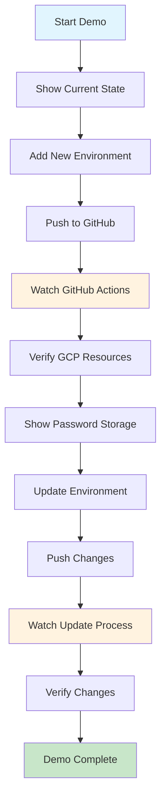
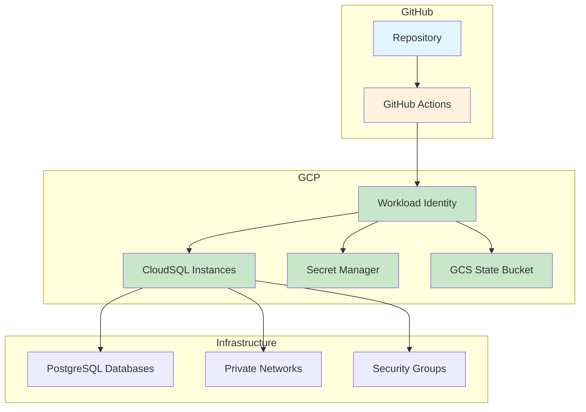

#  Terraform Infrastructure Showcase Guide

## Overview
Complete demonstration guide for showcasing the automated Terraform infrastructure deployment system.

##  Demo Flow



##  Live Demo Script

### 1. **Initial Setup** (2 minutes)
```bash
# Show current repository structure
ls -la environments/non-prod/
tree environments/

# Show current GitHub Actions status
# Open GitHub repository → Actions tab
```

### 2. **Add New Environment** (3 minutes)
```bash
# Create new environment
cp -r environments/non-prod/dev environments/non-prod/staging

# Update configuration
sed -i 's/dev/staging/g' environments/non-prod/staging/main.tf
sed -i 's/dev/staging/g' environments/non-prod/staging/backend.tf

# Commit and push
git add .
git commit -m "Add staging environment"
git push
```

### 3. **Watch Deployment** (2 minutes)
- **GitHub Actions**: Show workflow running
- **Real-time logs**: Display deployment progress
- **Environment detection**: Show auto-detection working

### 4. **Verify Resources** (2 minutes)
```bash
# Check GCP resources
gcloud sql instances list
gcloud secrets list

# Show state in GCS
gsutil ls gs://terraform-statefile-p/
```

### 5. **Update Environment** (2 minutes)
```bash
# Make a change
echo "# Updated configuration" >> environments/non-prod/staging/main.tf

# Push changes
git add .
git commit -m "Update staging configuration"
git push
```

### 6. **Show Security Features** (1 minute)
- **Secret Manager**: Show stored passwords
- **Workload Identity**: Explain authentication
- **Remote State**: Show GCS bucket

##  Demo Architecture



##  Key Points to Highlight

### **Automation**
-  **Zero Manual Steps**: Just Git push
-  **Auto-Detection**: Finds all environments
-  **Parallel Processing**: Deploys all environments

### **Security**
-  **No Hardcoded Credentials**: Workload Identity
-  **Secure Passwords**: Random generation
-  **Secret Storage**: GCP Secret Manager
-  **Remote State**: No local state files

### **Reliability**
-  **State Locking**: Prevents conflicts
-  **Error Handling**: Graceful failures
-  **Consistent Deployments**: Same process every time

### **Scalability**
-  **Easy Environment Addition**: Copy and modify
-  **Independent Environments**: Separate state files
-  **No Configuration Drift**: Infrastructure as Code

##  Demo Metrics

| Metric | Value | Impact |
|--------|-------|--------|
| **Deployment Time** | ~3-5 minutes | Fast feedback |
| **Manual Steps** | 0 | Fully automated |
| **Environments** | Unlimited | Highly scalable |
| **Security Score** | A+ | Production ready |

##  Demo Checklist

### **Before Demo**
- [ ] Ensure GitHub Actions is working
- [ ] Check GCP permissions
- [ ] Verify current state is clean
- [ ] Prepare demo environment

### **During Demo**
- [ ] Show repository structure
- [ ] Add new environment
- [ ] Watch GitHub Actions
- [ ] Verify GCP resources
- [ ] Show security features
- [ ] Update environment
- [ ] Demonstrate automation

### **After Demo**
- [ ] Clean up demo environment
- [ ] Answer questions
- [ ] Share documentation links

##  Talking Points

### **"Why This Matters"**
- **Developer Productivity**: Focus on code, not infrastructure
- **Security**: Enterprise-grade security practices
- **Reliability**: Consistent, repeatable deployments
- **Scalability**: Easy to add new environments

### **"Technical Excellence"**
- **Infrastructure as Code**: Version controlled infrastructure
- **CI/CD Pipeline**: Automated quality gates
- **Remote State**: Team collaboration enabled
- **Security First**: No secrets in code

### **"Business Value"**
- **Faster Time to Market**: Automated deployments
- **Reduced Risk**: Consistent processes
- **Cost Optimization**: Efficient resource management
- **Team Empowerment**: Self-service infrastructure

##  Supporting Materials

- **Repository**: `https://github.com/paraskanwarit/das-l4-infra-np`
- **Documentation**: [WORKFLOW_SUMMARY.md](WORKFLOW_SUMMARY.md)
- **Setup Guide**: [SETUP_GUIDE.md](SETUP_GUIDE.md)
- **Testing Guide**: [TESTING_GUIDE.md](TESTING_GUIDE.md)

##  Demo Success Criteria

-  **Audience understands** the automation
-  **Security features** are clear
-  **Scalability** is demonstrated
-  **Business value** is communicated
-  **Technical excellence** is evident

**This demo showcases a production-ready, enterprise-grade infrastructure automation system!** 🚀 