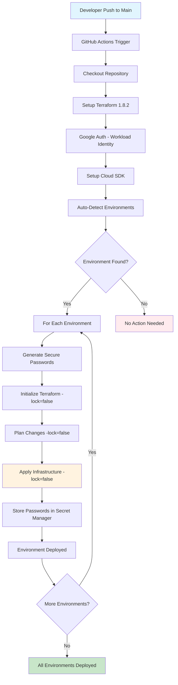
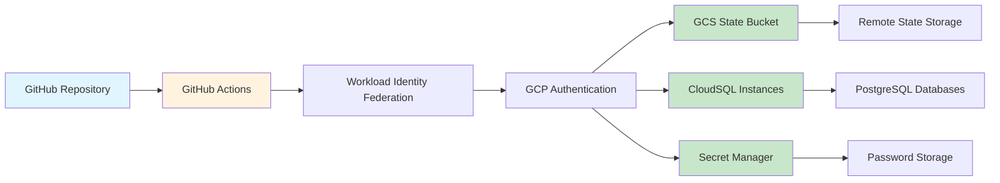

#  Terraform Infrastructure Workflow Summary

## Overview
Simple, automated Terraform deployment workflow for GCP CloudSQL environments with GitHub Actions CI/CD.

##  What It Does
- **Auto-detects** environments in `environments/non-prod/`
- **Deploys** all environments on every push to `main` branch
- **Generates** secure passwords and stores them in GCP Secret Manager
- **Runs** automatically - no manual triggers needed

##  Environment Structure
```
environments/non-prod/
├── dev/
│   ├── main.tf          # CloudSQL module configuration
│   ├── variables.tf     # Variable definitions
│   ├── backend.tf       # Remote state configuration
│   └── terraform.tfvars # Environment variables
└── [new-env]/           # Additional environments
    ├── main.tf
    ├── variables.tf
    ├── backend.tf
    └── terraform.tfvars
```

##  Complete Workflow Flow



##  Technical Architecture



##  Workflow Process

### 1. **Trigger**: Push to `main` branch with changes in `environments/non-prod/**`

### 2. **Environment Detection**:
```bash
ENVIRONMENTS=$(find environments/non-prod -maxdepth 1 -type d -name "*" | 
  grep -v "^environments/non-prod$" | 
  xargs -I {} sh -c 'if [ -f "{}/main.tf" ]; then basename "{}"; fi' | 
  sort)
```

### 3. **For Each Environment**:
- **Generate Passwords**: `openssl rand -base64 24`
- **Initialize**: `terraform init -lock=false`
- **Plan**: `terraform plan -lock=false`
- **Apply**: `terraform apply -auto-approve -lock=false`
- **Store Secrets**: `gcloud secrets create`

##  Security Features
-  **Workload Identity Federation**: No hardcoded credentials
-  **Secure Password Generation**: Random 32-character passwords
-  **Password Storage**: GCP Secret Manager with automatic replication
-  **Remote State**: All state in GCS bucket `terraform-statefile-p`
-  **State Lock Handling**: `-lock=false` prevents conflicts in CI/CD

##  How to Use

### Create New Environment
```bash
# Copy existing environment
cp -r environments/non-prod/dev environments/non-prod/new-env

# Update names and configurations
# Edit main.tf, variables.tf, backend.tf, terraform.tfvars

# Push to trigger deployment
git add .
git commit -m "Add new environment"
git push
```

### Update Existing Environment
```bash
# Make changes to environment files
# Push to trigger deployment
git add .
git commit -m "Update environment"
git push
```

##  Current Environments
-  **dev**: Development environment (PostgreSQL 16)

## 🔧 Technical Details
- **Terraform Version**: 1.8.2
- **State Storage**: GCS bucket `terraform-statefile-p`
- **Authentication**: Workload Identity Federation
- **CI/CD**: GitHub Actions
- **Database**: PostgreSQL 16 on CloudSQL

##  Important Notes
- **No manual triggers** - runs automatically on push
- **All environments deployed** on every push
- **State stored remotely** - no local state files
- **Simple and reliable** - no complex logic or conditions

##  Benefits
-  **Simple**: One workflow, no conflicts
-  **Automated**: No manual intervention needed
-  **Reliable**: Consistent deployment process
-  **Secure**: Proper credential management
-  **Scalable**: Easy to add new environments

##  Error Handling
- **State Lock Issues**: Automatically handled with `-lock=false`
- **Password Generation**: Secure random generation with `openssl`
- **Secret Storage**: Graceful handling of existing secrets
- **Environment Detection**: Robust detection of valid environments

##  Monitoring & Debugging
- **GitHub Actions Logs**: Full visibility into deployment process
- **GCS State**: Track infrastructure state changes
- **Secret Manager**: Monitor password storage
- **CloudSQL Console**: Verify database deployments 